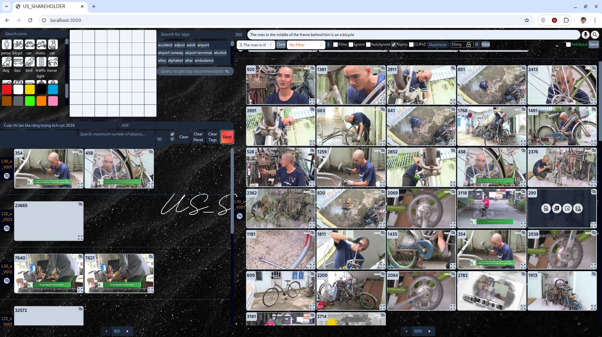

# News Retrieval Explain Challenge

Multimodal Video Search and Retrieval System for querying video content using text, visual elements, and contextual cues. 
Developed for the **HCM AI Challenge 2025**, focusing on multimodal representation learning for video retrieval.

## Features

- **Multimodal search** — Text, image similarity, OCR, ASR, object/tag filters
- **Scene-based retrieval** — Keyframe extraction and scene-aware search
- **Embeddings** — CLIP v2, Nomic, FAISS indexing
- **Web UI** — Next.js frontend, FastAPI backend, relevance feedback

## Tech Stack

- **Backend**: Python 3.8+, FastAPI
- **Frontend**: Next.js, React
- **Search**: FAISS, CLIP v2, Nomic, OCR/ASR/object retrieval
- **Optional**: CUDA GPU for embeddings

### UI Preview




---

## Data Setup

The app needs two datasets from Kaggle. Set them up as below so paths match the code.

### 1. Dictionary (metadata & embeddings)

- **Dataset**: [danielway17/dictionary](https://www.kaggle.com/datasets/danielway17/dictionary)
- **Purpose**: Metadata, IDs, and precomputed indices used by the backend.

**Steps:**

1. Install [Kaggle API](https://github.com/Kaggle/kaggle-api) and configure credentials (`~/.kaggle/kaggle.json`).
2. From the **project root**:

   ```bash
   kaggle datasets download -d danielway17/dictionary
   unzip dictionary.zip -d ./
   ```

3. Ensure the **`dict/`** folder lives at the project root with this structure (if the zip has a different top-level folder, move its contents into `dict/`):

   ```
   dict/
   ├── id2img.json              # keyframe ID → image_path, scene_idx
   ├── video_id2img_id.json
   ├── audio_id2img_id.json
   ├── img_id2audio_id.json
   ├── scene_id2info.json
   ├── video_division_tag.json
   ├── Nomic_cosine.bin
   ├── CLIPv2_cosine.bin
   ├── keyframes_id.json
   ├── audio_ASR/
   ├── context_encoded/
   ├── ocr/
   ├── bin/
   └── tag/
   ```

   Paths in `dict/id2img.json` use `image_path` like:  
   `/static/images/Keyframes/<data_part>/<video_id>/<frame_id>.jpg`  
   (e.g. `/static/images/Keyframes/L28_a/V016/019967.jpg`). Keep this format when replacing or regenerating the dictionary.

### 2. Keyframes (images)

- **Dataset**: [danielway17/keyframes-extracted-data](https://www.kaggle.com/datasets/danielway17/keyframes-extracted-data)
- **Purpose**: Keyframe images served by the frontend.

**Steps:**

1. Download and extract:

   ```bash
   kaggle datasets download -d danielway17/keyframes-extracted-data
   unzip keyframes-extracted-data.zip -d ./keyframes_download
   ```

2. Copy or symlink so images are under the frontend static path:

   ```bash
   mkdir -p frontend/public/static/images
   # If the zip contains a folder like "Keyframes" or "keyframes-extracted-data":
   cp -r keyframes_download/Keyframes frontend/public/static/images/
   # Or, if contents are directly <data_part>/<video_id>/<frame>.jpg:
   cp -r keyframes_download/* frontend/public/static/images/Keyframes/
   ```

3. **Target structure** (must match `image_path` in `dict/id2img.json`):

   ```
   frontend/public/static/images/Keyframes/
   └── <data_part>/          # e.g. L28_a
       └── <video_id>/       # e.g. V016
           └── <frame_id>.jpg
   ```


---

## Getting Started

### Prerequisites

- Python 3.8+
- Node.js 16+
- (Optional) CUDA GPU for local embedding runs

> **Note:** The running configuration requires a GPU with **minimum 4GB VRAM**.

### Backend

```bash
git clone https://github.com/danielway2k3/News-Retrieval-Explain-Challenge.git
cd News-Retrieval-Explain-Challenge

pip install -r requirements.txt
python app.py
```

Runs by default on `http://localhost:8080`.

### Frontend

```bash
cd frontend
npm install
npm run dev
```

Open the URL shown (e.g. `http://localhost:3000`).

### Socket server (WebSocket / competition submission)

The frontend uses a Socket.IO server for real-time features and competition submission. Run it in a **separate terminal** from the project root:

```bash
python socket_app.py
```

Runs by default on `http://localhost:8081`. The frontend expects this URL in `frontend/src/helper/web_url.js` (`socket_url`). For submission-only use, the endpoint is `http://localhost:8081/submit`.

### Quick check

- For full functionality, run **backend** (port 8080), **frontend** (port 3000), and **socket server** (port 8081).
- Backend needs `dict/` with the files above; Keyframes images must be at `frontend/public/static/images/Keyframes/<data_part>/<video_id>/<frame>.jpg`.
- If keyframe images are under a different base URL, set `images_base_url` in `frontend/src/helper/web_url.js` and configure your backend/Next.js image domains if required.

---

## Project Structure

```
├── app.py                 # FastAPI app, search endpoints
├── socket_app.py          # WebSocket server
├── requirements.txt
├── docs/images/           # Screenshots for README (e.g. ui-search.png)
├── dict/                  # From Kaggle "dictionary" (see Data Setup)
├── frontend/              # Next.js app
│   ├── public/static/images/Keyframes/   # From Kaggle "keyframes-extracted-data"
│   └── src/
├── notebooks/             # Data prep, scene extraction, embeddings
├── utils/                 # FAISS, search, semantic/OCR/ASR/object engines
└── video_split.py, export_name_obj.py
```

---

## API Overview

| Method | Endpoint       | Description              |
|--------|----------------|--------------------------|
| POST   | `/textsearch`  | Text query search        |
| GET    | `/imgsearch`   | Image similarity search  |
| POST   | `/panel`       | Multi-modal panel (OCR, ASR, objects, tags) |
| POST   | `/feedback`    | Relevance feedback       |
| POST   | `/getrec`      | Tag recommendations      |
| POST   | `/translate`   | Query translation        |
| GET    | `/data`        | Paginated video data     |
| GET    | `/relatedimg`  | Related keyframes        |
| GET    | `/getvideoshot`| Video shot info          |

Example — text search:

```bash
curl -X POST http://localhost:8080/textsearch \
  -H "Content-Type: application/json" \
  -d '{"textquery": "person on bridge", "k": 20, "nomic": true, "clipv2": true, "search_space": 0, "range_filter": 5, "filter": false}'
```

---

## Search Methods

- **Semantic**: CLIP v2 + Nomic embeddings, combined search
- **Context**: Object bbox, OCR text, ASR, color/tags
- **Temporal**: Scene/shot filtering, related keyframes within scenes

